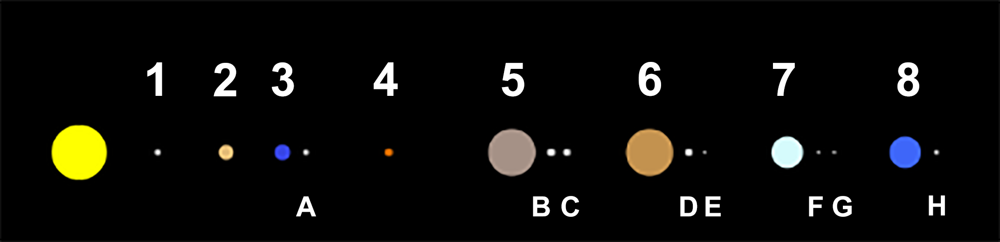

# Solar System

Simple React App which mimics [the steampunk model](https://www.google.com/search?q=steampunk+solar+system&rlz=1C1GCEA_enPL968PL968&source=lnms&tbm=isch&sa=X&ved=2ahUKEwj_vNbSgd_4AhVgRvEDHZXlBtkQ_AUoAXoECAMQAw&biw=1920&bih=1089&dpr=1) of the Solar System.

From the understandable reasons (at least I think these are known to everyone), the distances between all the presented celestial bodies (i.e. sun, planets and moons) and their sizes are not proportional. There are two scales: one for the distances from the Sun and the second - for the sizes. The differences, compared to the real Solar System data, are shown in the tables below.

My very goal was to reproduce the corellation of the movement between all the bodies as well as it is possible. As for the real watchmaker's model, although the dimenions are not reliable, the relative angular speeds for all the planets and all the moons as kept. The very base, to which other speeds are relative, is the mean tropical year duration value, equal to 365.2421896698. I plan to be even more precise, using the Newcomb's expression (https://en.wikipedia.org/wiki/Tropical_year), but this change won't be affect the project behaviour (as it won't be visible within the canvas).

Scale for radius:

| Index | Planet Name | r/E\*  | Model |       Other info       |
| :---: | ----------- | :----: | :---: | :--------------------: |
|   1   | Mercury     | 0.383  | 0.383 |           OK           |
|   2   | Venus       | 0.949  | 0.949 |           OK           |
|   3   | Earth       | 1.000  | 1.000 |           OK           |
|   4   | Mars        | 0.532  | 0.532 |           OK           |
|   5   | Jupiter     | 11.209 | 3.000 | Should be 3.763 bigger |
|   6   | Saturn      | 9.499  | 3.000 | Should be 3.166 bigger |
|   7   | Uranus      | 4.007  | 2.000 | Should be 2.003 bigger |
|   8   | Neptune     | 3.882  | 2.000 | Should be 1.941 bigger |

\*r/E = radius in correlation to Earth's radius

Scale for distance:

| Index | Planet Name | d/E\*  | d/M\*  | Model |       Other info        |
| :---: | ----------- | :----: | :----: | :---: | :---------------------: |
|   1   | Mercury     | 0.387  | 1.000  | 1.000 |           OK            |
|   2   | Venus       | 0.723  | 1.869  | 1.869 |           OK            |
|   3   | Earth       | 1.000  | 2.583  | 2.583 |           OK            |
|   4   | Mars        | 1.524  | 3.936  | 3.936 |           OK            |
|   5   | Jupiter     | 5.203  | 13.442 | 5.500 | Should be 2.444 further |
|   6   | Saturn      | 9.537  | 24.637 | 7.250 | Should be 3.398 further |
|   7   | Uranus      | 19.191 | 49.577 | 9.000 | Should be 5.509 further |
|   8   | Neptune     | 30.069 | 77.678 | 10.50 | Should be 7.398 further |

\*d/E = distance in correlation to distance between the Sun and the Earth,\
\*d/M = distance in correlation to distance between the Sun and Mercury

Scale for satellite radius (all the satellites are 1.25x bigger than they should be):

| Index | Satellite Name | r/M\* | r/E\*  | Model (1.25x) |
| :---: | -------------- | :---: | :----: | :-----------: |
|   A   | Moon           | 1.000 | 0.2727 |    0.3409     |
|   B   | Ganymede       | 1.516 | 0.4133 |    0.5166     |
|   C   | Callisto       | 1.387 | 0.3782 |    0.4727     |
|   D   | Titan          | 1.481 | 0.4040 |    0.5050     |
|   E   | Iapetus        | 0.432 | 0.1154 |    0.1433     |
|   F   | Titania        | 0.454 | 0.1238 |    0.1547     |
|   G   | Oberon         | 0.438 | 0.1195 |    0.1493     |
|   H   | Trition        | 0.779 | 0.2124 |    0.2654     |

\*r/M = radius in correlation to Moon's radius,\
\*r/E = radius in correlation to Earth's radius

Legend:

## TODO's

Find the starting point for current date(!)\
Canvas.jsx => Canvas.tsx (null ref error)

## Page URL:

https://mroch4.github.io/SolarSystem/
